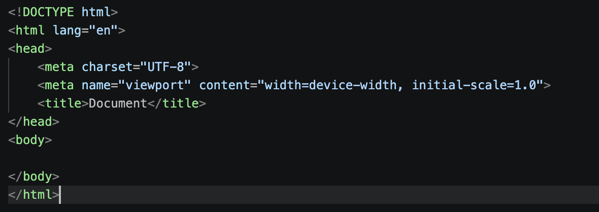
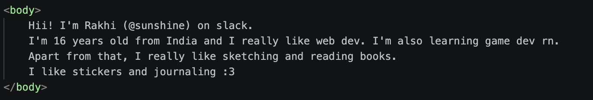
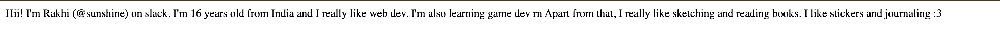
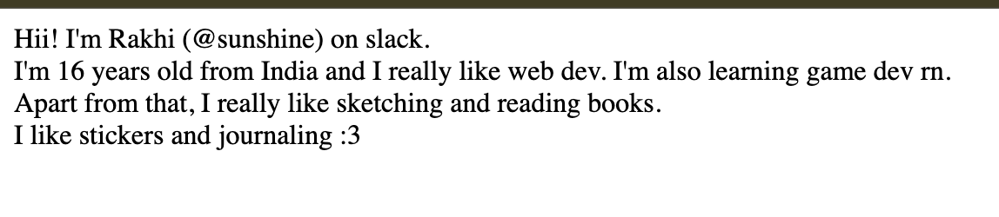
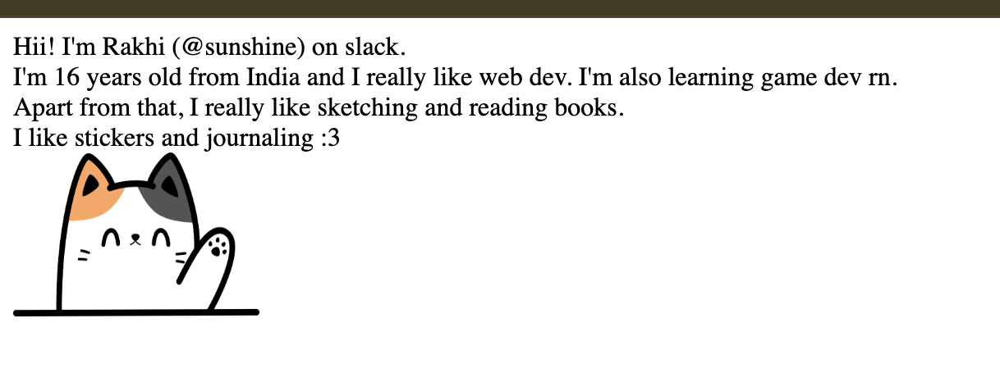
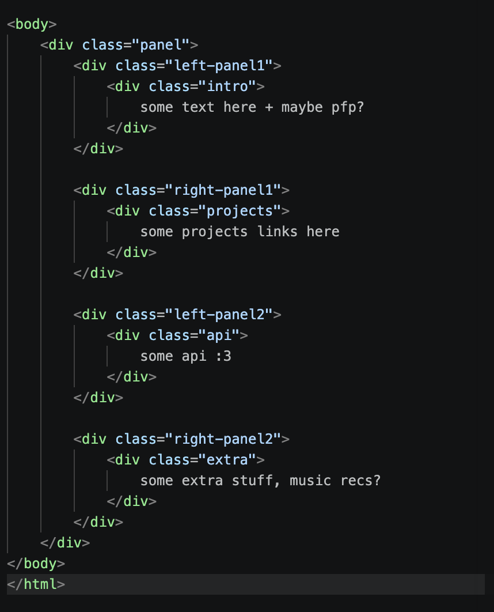

## Hi there, today we are making a personal info panel :>

**What is a personal info panel?** <br>
An personal info panel is a small space/dashboard for yourself or others to see personal details about you in a quick glance.
It is a beginner level web-dev project and this is a guide to help you with it :>

**prerequisites**
- HTML Basics (coverered in this guide)
- SS (covered in this guide)
- JS (also covered in this guide)
- A code editor (im using VSCODE) + Hacaktime installed [hackatime](hackatime.hackclub.com)
- Github repo 
- A deploying site (vercel, github pages etc)

*Let's start with the basic structure of a webpage, and it is made using HTML*
<BR>

**HTML** stands for Hyper Text Markup Language, it's basically the structure of a webpage and defines a browser what things are on the page such as links, buttons, images, videos etc. <br>
**CSS** stands for Cascading Style Sheets, it is used to format and design the structure, think of adding colors, different fonts, design styles etc <br>

**JS** is javascript and is responsible for adding interactivity in a webpage, for example, updating texts, fetching info from APIs 

in short:
- **HTMl** : structure 
- **CSS** : style
- *JSS** : behavior/style 

lets go over each one slowly!

# HTML
this is a basic code of a HTML:
``` <html>
<head>
    <title> TITLE </title>
</head>
<body>
body of the page
</body>
</html> 
```

We use **</>** to create "tags" in html, what are tags you ask?
Tags are instructions given to a web browser to act a specific way, it could be adding links, creating images etc
Most tags inside HTML are in pairs i.e. they have a opening **<>** and a closing 'slash' attached to it **</>**, it is added to tell the browser where that element ends. <br>
Some examples would be;
```<html> ...... </html>
<body> ...... </body>
<p> ..... </p>
```

But all the tags are not built that way, some tags such as `<br>, <hr>` etc do not have a closing tag because they dont have any content inside them. For example, `<br>` tag is used to break lines in HTML while writing, it doesnt has any content inside the tag, its only work is to break a line and start fresh from a new line. <br>

Phew! That's a lot of info, but what about how are these tags used? Yess! Let's go over the basic tags slowly :>
- `<html>....</html>` : It is the root tag of HTML, an html document should always begin with `<html>` tag and end with `</html>`
- `<head>...</head>`: It is used for storing info which isn't directly visible on the webpage, such as `<title>` tag or linking to css page (we'll get to it!) etc
- `<title>...</title>`: Title is the text which appears on a browser tab
- `<body>...</body>`: The main visible content visible on the webpage goes here

Other tags include: <br>
- ``: For adding images in the webpage 
- `<a>...</a>`: for adding links 
- `<h1> to <h6> tags`: for different sizes of text appearing
- `<p>...</p>`: for adding paragraphs

Woah, that was a lot of info! 
Lets get to coding now and get some work done in setting up in our structure for our personal info page! 

When you open any editor, im using VS code here, an html file is saved with .html and "index.html" is the default name servers look for while opening the site.
For VS Code, you can press `!` and you will see something like this appear in your file:


You can change the title to your liking, im keeping "infor" T^T

**tip**: If you're using VS CODE, I really recommend downloading an extension called "Live server" by Ritwick Dey, so you can see the work you're doing locally and change accordingly. <br>

After changing the title, you should be able to see this: <br>


Now, you can start entering some details about yourself, it can be just random stuff, you can always update it later! <br>
I've added this, a small intro:


You'd see the content like this in your browser:


There, you have a something on your site now but it doesn't look too well because it is not styled yet, lets add a few tags and see further. <br>
I'm adding a `<br>` tag at the end of all lines. And it looks much better now! 


Feel free to add tags like `<h1>...</h6>`, `<b>`, `<i>` etc to your introduction.
<hr>
Now, we'll be adding an image:

The syntax for adding images is: `` and its attributes inside the tag, some of it includes:
- `src`: src is also one of img tag attributes, it used to add the path of the image
- `alt`: optional, it helps in describing the image if its unable to load
- `height`: for defining the height of the image
- `width`: for defining the width of the image

You can add images, svg and gif from `` tag.

so go ahead and add a image to your code, it could be anything you like :3 <br>
my page looks like this now!


<hr>
Now to make out personal info panel:
The first thing we're gonna do is to delete our previous code and start making `<div>`.
What is `<div>`? It is a box tag which is used to group particular elements so they can be styled together etc.

If you wish to define your page in more structural way, there also exists tags such as `<header>, <main>, <section> etc` which are used to set up different sections of a website.

Since its a beginner leveled guide, we'll only be using <div> tag.

**Tip**: I'd really recommed mapping out how you'd like your sections to be, how many boxes, how they'd be divided roughly on a piece of paper or digitally before making divs. I'm dividing the page in 4 parts as:
- First: Intro/profile
- Second: some api (i'd be using cat api :3)
- Third: some projects you've worked on 
- Fourth: some music recommends or a fun fact 

You can always decide what data you want to keep yourself and how you want to keep it.

So, also <div> tags come in pairs, so whenever you're opening one, make sure to close it too.
Now, in <div> tag, for selecting elements, you can use both different attributes, let me go over them quickly.

- "class": it is used when we want to use the same property on multiple elements present inside the tag. To add css properties we use ".xyz{}"
- "id": it is a used when we want to add a unique property to the elements inside the tag, to add css properties, we use "#xyz{}"

Here's what i have done:


Add as many <div> elements as you need and make sure to close them. I'd recommend writing the div tags from left to right, in row to row order, since we'll be using grid in css properties. 

Alright we're done with HTML for now, now we'll learn CSS and styling your page. 


# CSS
Wooo! Now let's start with CSS, like before, CSS stands for Cascading Style Sheets and it is used to add different colors, fonts, just styling, so our page looks better. <br>

For adding css to your page, you can use it in different ways, I recommend using the external css version, it helps in keeping our project organized.
So, begin with, start by adding ` <link rel="stylesheet" href="">` in the `<head>` tag of your html file. <br>
`rel` and `href` are attributes of `<link>` tag.
- `rel="stylesheet"` is telling the browser this file contains css.
- `href` is used for adding the link of the file which contains out css codes. 
<br>
So, add your file name with .css at the end of your file name and attach it to the `href=""`.
<br>
Let's start by adding background color to our page before I explain the different attributes we'll be using. (these steps are after you've created your css file and inside it)

```body{
    background-color: rgb(115, 115, 212);
}
```
here background-color is the property we're using for changing the background color of the page, you can choose any color you like. If it doesnt work, please check semicolon, use of correct brackets etc. 

<br>
I'll go over the most used css properties quickly, if i use anything apart from these, i'll explain it in that section.

- `background-color`: to chage the color of color of the page or an element
- `color`: is used to change color of texts
- `font-size`: is used to change the size of text
- `font-family`: it is used to change different fonts of texts such as comic sans, arial, sans serif etc.
- `text-align`: used to align text
- `width`: to set the width of the element used
- `height`: to set the height of the element used
- `margin`: to add space outside of an element
- `padding`: to add space inside of an element
- `border`: to set the color, type and size of the element's border
- `border-radius`: to round the corners of a box element

woo! these are most common css properties used, now lets get back to our profile page. right now our text is simply there, lets work on css and add borders and make our layout.